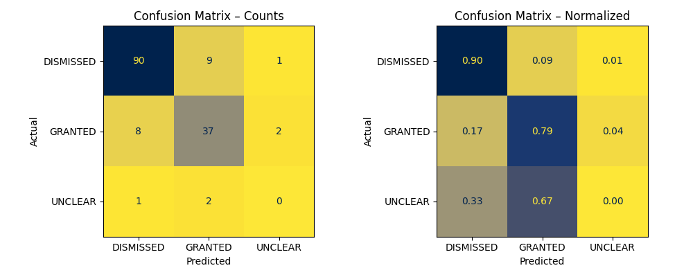

# 📚 Court of Appeal Case Processor

This project automates the scraping, processing, and classification of UK Court of Appeal judgments.  
It uses Natural Language Processing (NLP) with **spaCy** to detect and label appeal outcomes —  
`GRANTED`, `DISMISSED`, or `UNCLEAR` — directly from legal documents.

---

## 🔗 Results

Law firm statistics table and case-by-case analysis:  
👉 [https://liamdrans.github.io/court-of-appeal/](https://liamdrans.github.io/court-of-appeal/)

---

## 🧱 Project Structure

| Script | Purpose |
|--------|----------|
| `scraper.py` | Downloads and stores legal case data from the Court of Appeal website. |
| `process_legal_cases.py` | Cleans and normalizes scraped data into a consistent format. |
| `appeal_verdict_identifier.py` | Applies rule-based NLP to classify appeal outcomes. |
| `appeal_outcome_evaluation.py` | Evaluates classifier accuracy using confusion matrices and performance metrics. |

---

## 🧠 How It Works

1. **Scraping (`scraper.py`)**  
   Collects cases by year or date, extracting full texts and metadata for each judgment.

2. **Processing (`process_legal_cases.py`)**  
   Cleans raw text (removes HTML, fixes encoding, standardizes structure) and outputs `.pkl` files.

3. **Verdict Classification (`appeal_verdict_identifier.py`)**  
   Uses `spaCy`'s `Matcher` to identify key phrases like:  
   - “the appeal is dismissed”  
   - “I would allow the appeal”  
   - “the outcome is unclear”  
   These are mapped to one of three labels: `DISMISSED`, `GRANTED`, or `UNCLEAR`.

4. **Evaluation (`appeal_outcome_evaluation.py`)**  
   Compares the classifier’s predictions with a manually reviewed sample to assess accuracy.

---

## 📊 Evaluation Summary

A manually reviewed dataset of **150 cases** was used to evaluate rule-based classification performance across three outcome types:  
`DISMISSED`, `GRANTED`, and `UNCLEAR`.

### Confusion Matrix (Counts + Normalized)

**Interpretation**
- Strong performance on **DISMISSED** cases (≈ 90 % correct).  
- **GRANTED** outcomes show moderate recall, sometimes confused with *DISMISSED*.  
- **UNCLEAR** cases remain challenging due to ambiguous judicial phrasing and low frequency.

### Weighted Performance Metrics

| Metric | Score |
|--------|--------|
| Accuracy | **0.85** |
| Precision | **0.84** |
| Recall | **0.85** |
| F1-score | **0.84** |

> These metrics form a solid rule-based baseline.  
> Future iterations will benchmark ML models (e.g. logistic regression, transformer fine-tuning) to compare performance.

---

## 🧑‍⚖️ Use Cases

- Legal analytics and decision-trend visualization  
- Training data for machine learning in legal NLP  
- Judicial transparency and academic research  

---

## 🚀 Next Steps

- Develop a simple ML baseline for comparison  
- Expand evaluation dataset and include inter-annotator validation  
- Handle edge cases like *partially allowed* or *set aside* outcomes  

---

*Maintained by [Liam Dransfield](https://github.com/LiamDrans)*  
